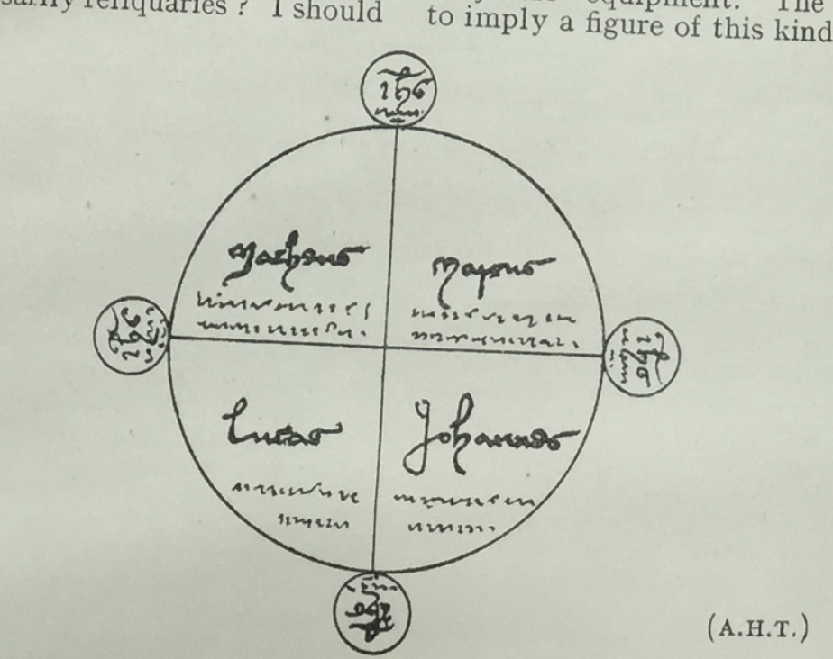

# TWELVE MEDIEVAL GHOST STORIES. 

The following ghost stories were published by Dr. M. R. James, 
the Provost of Eton College, in the English Historical Review of 
July 1922, in a careful transcript from the original Latin. Their 
connection with Byland Abbey, the appearance in them of well-known Yorkshire villages and names, recommended them for republication in the Yorks. Arch. Journal. They have been translated 
into English to make them accessible to a wider public than could be 
expected to penetrate the medieval Latin. Dr. James’ introduction 
is reprinted, and also his notes except in so far as they refer to 
difficulties in the Latin. Other notes have been added by Dr. 
Hamilton Thompson, who has also given me much assistance and 
saved me from mistakes in translating the Latin. Dr. Thompson 
has also added a topographical note which he has compiled with 
the assistance of Dr. William Brown. 

The thanks of the Yorkshire Archaeological Society are due to 
Dr. James and to Mr. G. N. Clark, M.A., the Editor of the English 
Historical Review, for permission to translate and print these stories. 

A. J. Grant. 

## Twelve Medieval Ghost Stories. 

These stories were, I believe, first noticed in the recent Catalogue 
of the Royal Manuscripts, where a brief analysis of them is given 
which may well have excited the curiosity of others beside myself. 
All that Casley has to say of them in the old catalogue is “Exemplaria apparitionum spirituum (saec.) XV.” 

I took an early opportunity of transcribing them, and I did not 
find them disappointing ; I hope others will agree that they deserve 
to be published. 

The source is the Royal MS. 15, A. XX, in the British Museum. 
It is a fine volume of the twelfth and early thirteenth centuries, containing some tracts of Cicero and the Elucidarium. It belonged 
to Byland Abbey (Yorkshire) and later to John Theyer. 

On blank pages in the body of the book (ff. 140-3) and at the end 
(fo. 163 h) a monk of Byland has written down a series of ghost 
stories, of which the scenes are laid in his own neighbourhood. 
They are strong in local colour, and, though occasionally confused, 
incoherent and unduly compressed, evidently represent the words 
of the narrators with some approach to fidelity. 

To me they are redolent of Denmark. Anyone who is lucky 
enough to possess E. T. Christensen’s delightful collections of *Sagn 
fra Jylland* will be reminded again and again of traits which occur 
there. Little as I can claim the quality of “folklorist,” I am 
fairly confident that the Scandinavian element is really prominent 
in these tales. 

The date of the writing cannot be long after 1400 (c. 1400 is the 
estimate of the catalogue). Richard II’s reign is referred to as 
past. A study of local records, impossible to me, might not improbably throw light upon the persons mentioned in the stories. 

The hand is not a very easy one, and the last page of all is really 
difficult; some words have baffled me. The Latin is very refreshing. - M. R. James. 

## I. Concerning the ghost of a certain labourer at Ryevaulx who helped a man to carry beans. 

A certain man was riding on his horse carrying on its back a 
peck of beans. The horse stumbled on the road and broke its shin 
bone; which when the man saw he took the beans on his own 
back. And while he was walking on the road he saw as it were a 
horse standing on its hind feet and holding up its fore feet. In 
alarm he forbade the horse in the name of Jesus Christ to do him 
any harm. Upon this it went with him in the shape of a horse, and 
in a little while appeared to him in the likeness of a revolving hay- 
cock 1 with a light in the middle; to which the man said, “God for- 
bid that you bring evil upon me.” At these words it appeared 
in the shape of a man and the traveller conjured him. Then the 
spirit told him his name and the reason (of his walking) and the 
remedy, and he added, “Permit me to carry your beans and to help 
you.” And thus he did as far as the beck but he was not willing 
to pass over it ; and the living man knew not how the bag of beans 
was placed again on his own back. And afterwards he caused 
the ghost to be absolved and masses to be sung for him and he was 
eased. 

1 So in No. II a ghost is said to appear “in specie dumi” (as I read it), i.e. of a thorn bush. In several of these stories the ghosts are liable to many changes of form. — M.R.J.

## II. Concerning a wonderful encounter between a ghost and a living man in the time of King Richard II. 

It is said that a certain tailor of the name of [blank] Snowball 
was returning on horseback one night from Gilling to his home in 
Ampleforth, and on the way he heard as it were the sound of ducks 
washing themselves in the beck, and soon after he saw as it were a 
raven that flew round his face and came down to the earth and 
struck the ground with its wings as though it were on the point of 
death. And the tailor got off his horse to take the raven, and as 
he did so he saw sparks of fire shooting from the sides of the raven. 
Whereupon he crossed himself and forbade him in the name of God 
to bring at that time any harm upon him. Then it flew off with 
a great screaming for about the space of a stone’s throw. Then 
again he mounted his horse and very soon the same raven met him 
as it flew, and struck him on the side and threw the tailor to the 
ground from the horse upon which he was riding ; and he lay stretched 
upon the ground as it were in a swoon and lifeless, and he was 
very frightened. Then, rising and strong in the faith, he fought 
with him with his sword until he was weary; and it seemed to him 
that he was striking a peat-stack; and he forbade him and conjured him m the name of God, saying, “ God forbid that you have 
power to hurt me on this occasion, but begone.” And again it 
flew off with a horrible screaming as it were the space of the flight 
of an arrow. And the third time it appeared to the tailor as he was 
carrying the cross of his sword upon his breast for fear, and it met 
him in the likeness of a dog with a chain on its neck. And when 
he saw it the tailor, strong in the faith, thought within himself, 
hat will become of me ? I will adjure him in the name of the 
Trinity and by the virtue of the blood of Christ from His five wounds 
that he speak with me, and do me no wrong, but stand fast and 
answer my questions and tell me his name and the cause of his 
punishment and the remedy that belongs to it.” And he did so 
And the spirit, panting terribly and groaning, said, “ Thus and 
thus did I, and for thus doing I have been excommunicated . 1 Go 
therefore to a certain priest and ask him to absolve me. And it 
behoves me to have the full number of nine times twenty masses 
celebrated for me. And now of two things you must choose one. 
Hither you shall come back to me on a certain night alone bringing 
to me the answer of those whose names I have given you; and I 
will tell you how you may be made whole, and in the mean time you 
need not fear the sight of a wood fire.2 Or otherwise your flesh 

1 Great pains have been taken through- 
out to conceal the name of the ghost. He 
must have been a man of quality whose 
relatives might have objected to stories 
being told about him. — M.R.J.

2 In the Danish tales something like 
this is to be found. Kristensen *Sagn og 
overtro* 1866, No. 585: After seeing a 
phantom funeral “the man was wise 
enough to go to the stove and look at the 
fire before he saw (candle- or lamp-) light. 
For when people see anything of the kind 
they are sick if they cannot get at fire 
before light.” Ibid., No. 371.: “He was 
very sick when he caught sight of the 
light.” The same in No. 369. In Part 
II of the same (1888), No. 690: “When 
you see anything supernatural, you 
should peep over the door before going 
into the house. You must see the light 
before the light sees you.” Collection of 
1883, No. 193: “When he came home, he 
called to his wife to put out the light before he came in, but she did not and he 
was so sick they thought he would have 
died.” These examples are enough to 
show that there was risk attached to 
seeing light after a ghostly encounter. — M.R.J. 

shall rot and your skin shall dry up and shall fall off from you utterly 
in a short time. Know moreover that I have met you now because 
to-day you have not heard mass nor the gospel of John (namely 
in principio), and have not seen the consecration of our Lord's body 
and blood, for otherwise I should not have had full power of appearing 
to you ." 1 And as he spoke with the tailor he was as it were on 
fire and his inner parts could be seen through his mouth and he 
formed his words in his entrails and did not speak with his tongue. 
Then the tailor asked permission from the ghost that he might have 
with him on his return some companion. But the ghost said, No; 
but have upon you the four gospels and the name of victory, namely 
Jesus of Nazareth, on account of two other ghosts that abide here 
of whom one cannot speak when he is conjured and abides in the 
likeness of fire or of a bush and the other is in the form of a hunter 
and they are very dangerous to meet. Pledge me further on this 
stone that you will defame my bones 2 to no one except to the priests 
who celebrate on my behalf, and the others to whom you are sent on 
my behalf, who may be of use to me." And he gave his word 
upon the stone that he would not reveal the secret, as has been 
already explained. Then he conjured the ghost to go to Hodgebeck 3 
and to await his return. And the ghost said, “No, no, and 
screamed. And the tailor said, Go then to Byland Bank, 
whereat he was glad. 

The man of whom we speak was ill for some days, but then 
got well and went to York to the priest who had been mentioned, 
who had excommunicated the dead man, and asked him for absolution. But he refused to absolve him, and called to him another 
chaplain to take counsel with him. And that chaplain called in 
another, and that other a third, to advise secretly concerning the 

1 This rather suggests that you might 
be reckoned to have kept a mass if you 
came only in time for the last gospel. — A.H.T. 

2 Defaming (*defamatio* or *diffamatio*) is 
the formal accusation of crime which 
renders a man liable to spiritual censure, 
and puts him in a state of inf amici from 
which he must free himself by compurgation or by establishing a suit against his 
defamer in the spiritual court. The 
*infamia* of a dead man (resting here on 
his own acknowledgment) would place 
him outside the privilege of Christian 
burial and lead to the disinterment of his 
remains. Cf. the posthumous defamation 
and disinterment of Wycliffe for heresy. - A.H.T. 

3 I suppose in order that the ghost 
might not haunt the road in the interval 
before the tailor’s return. — M.R.J. 

absolution of this man . 1 And the tailor asked of him, “Sir, you 
know the mutual token that I hinted in your ear.” And he answered, . Yes, my son.” Then after many negotiations the tailor 
made satisfaction and paid live shillings and received the absolution 
written on a piece of parchment, and he was sworn not to defame the 
dead man but to bury the absolution in his grave near his head, 
and secretly. And when he had got it he went to a certain brother 
Richard of Pickering, a confessor of repute, and asked him whether 
the absolution were sufficient and lawful. And he answered that 
it was. Then the tailor went to all the orders of the friars of York 
and he had almost all the required masses celebrated during two or 
three days, and coming home he buried the absolution in the grave 
as he had been ordered. And when all these things had been duly 
carried out he came home, and a certain officious neighbour of his, 
healing that he had to report to the ghost on a certain night all 
that he had done at York, adjured him, saying, “God forbid that 
you go to this ghost without telling me of your going and of the 
day and the hour.” And being so constrained, for fear of displeasing 
God, he told him, waking him up from sleep and saying, “I am 
going now. If you wish to come with me let us set off and I will give 
you a part of the writings that I carry on me because of night fears.” 
Then the other said, “Do you want me to go with you,” and the 
tailor said, You must see to that; I will give no advice to you.” 
Then at last the other said, “ Get you gone in the name of the Lord 
and may God prosper you in all things.” 2 After these words he 
came to the appointed place and made a great circle with a cross 3 
and he had upon him the four gospels and other holy words and he 
stood in the middle of the circle and he placed four reliquaries in 
the form of a cross on the edge of the circle; and on the reliquaries 
were written words of salvation, namely Jesus of Nazareth, etc., 
and he waited for the coming of the ghost. He came at length in 

1 The reluctance of the priest at York 
to absolve and the number of advisers 
called in testify to the importance of the 
case.— M.R.J.

2 The conduct of the officious neigh- 
bour who insists upon being informed of 
the tailor s assignation with the ghost and 
then backs out of accompanying him is 
amusing. — M.R.J.

3 Whether a circle enclosing a cross or 
a circle drawn with a cross I do not know 
M.R.J. 
I think there can be no doubt that it 
was a circle with a cross drawn inside it at 
the points of which, where they meet the 
circumference, the reliquaries (*monilia*) 
were placed. I am not quite sure 
whether the passage does not mean that 
the names of the four gospels (i.e. the 
evangelists) and other sacred words were 
written in the quadrants of the circle. 
The magic circle plays a great part in 
a case of sorcery recorded in York Reg.
Bainbridge and printed in *Archaeol. 
Journal*, xvi. It was here drawn on a 
huge sheet of parchment in a private 
house by an ingenious person who induced a number of people to combine 
with him m conjuring demons to reveal 
the hiding-place of a treasure at Mixendale Head, near Halifax. There is no 
mention of its being drawn with a cross 
or of a cross inscribed in it; it was copied 
from a conjuring book. It was inscribed 
however, "cum carecteribus et nominibus aliusque signis supersticiosis”; and 
one deponent, who arrived unexpectedly 
while the performance was going on, saw 
that the party “had a grete masse boke 
opyn afore theyme, and wrote oute what 
they wold”; cf. the “other sacred 
words” which the present spirit ordered 
his conjuror to bring with him. Are the 
*monilia* necessarily reliquaries? I should 
have thought that, in the present case, 
they might rather be medallions on which 
the *titulus triumphalis* was engraved, like 
the *laminae* of lead inscribed with figures 
of “Oberion,” “Storax,” and other 
spirits which formed part of the Halifax 
conjurors’ equipment. The text seems 
to imply a figure of this kind: — A.H.T.

    

the form of a she-goat and went thrice round the circle saying, 
“ Ah! ah! ah! ” And when he conjured the she-goat she fell 
prone upon the ground, and rose up again in the likeness of a man 
of great stature, horrible and thin, and like one of the dead kings 
in pictures . 1 And when he was asked whether the tailor's labour 
had been of service to him, he answered, “ Yes, praised be God. 
And I stood at your back when you buried my absolution in my 
grave at the ninth hour and were afraid. No wonder you were 
afraid, for three devils were present there who have tormented me 
in every way from the time when you first conjured me to the time 
of my absolution, suspecting that they would have me but very little 
time in their custody to torment me. Know therefore that on 
Monday next I shall pass into everlasting joy with thirty other 
spirits. Go now to a certain beck and you will find a broad stone; 
lift it up and under it you will find a sand stone. Wash your whole 
body with water and rub it with the stone and you will be whole 
in a few days /’ 2 When he was asked the names of the two ghosts, 
he answered, I cannot tell you their names. And when asked 
about their condition he answered that one was a layman and a 
soldier and was not of these parts, and he killed a woman great 

1 I think the allusion is to the pictures 
of the Three Living and the Three Dead 
so often found painted on church walls. 
The Dead and Living are often represented as Kings.— M.R.J.
One of the best examples (though only 
the “Trois Vifs” remain) of this kind 
of painting is over the north doorway at 
Lutterworth, and there is a very good 
example at Paston, Norfolk. — A.H.T.

2 The need of a prescription for healing 
the tailor was due to the blow in the side 
which the raven had given him. — M.R.J.

with child and he will find no remedy before the day of judgment, 
and you will see him in the form of a bullock without mouth or eyes 
or ears; and however you conjure him he will not be able to 
speak. And the other was a man of religion in the shape of a hunter 
blowing upon a horn; and he will find a remedy and he will be conjured by a certain boy who has not yet come to manhood, if the 
Lord will.” And then the tailor asked the ghost of his own condition 
and received answer, "You are keeping wrongfully the cap and coat 
of one who was your friend and companion in the wars beyond 
the seas. Give satisfaction to him or you will pay dearly for it.” 
And the tailor said, " I know not where he lives ”; and the ghost 
answered, " He lives in such a town near to the castle of Alnwick.” 
When further he was asked, "What is my greatest fault ?” the ghost 
answered, " Your greatest fault is because of me.” And the man 
said, How and in what way ? ” And the ghost answered, " Because the people sin telling lies concerning you and bringing scandal 
on other dead men saying the dead man who was conjured was he 
or he— or he.” And he asked the ghost, "What shall I do? I 
will reveal your name?” And he said, "No; but if you stay in 
one place you will be rich, and in another place you will be poor, 
and you have here certain enemies .” 1 Then the spirit said, " I can 
stay no longer talking with you.” And as they went their different 
ways, the deaf and dumb and blind bullock went with the man as 
far as the town of Ampleforth; whom he conjured in all the ways 
that he knew, but by no means could he make answer. And the 
ghost that had been aided by him advised him to keep all his best 
writings by his head until he went to sleep. " And say neither 
more nor less than I advise you and keep your eyes on the ground 
and look not on a wood fire for this night at least .” 2 And when he 
came home he was seriously ill for several days. 

## III. Concerning the ghost of Robert the son of Robert de Boltby of Kilburn, which was caught in a churchyard. 

I must tell you that this Robert the younger died and was buried 
in a churchyard, but he had the habit of leaving his grave by night 

1 This does not seem logically to follow 
upon the prohibition to tell the ghost’s 
name. I take it as advice to the tailor 
to change his abode. — M.R.J.

2 I do not quite understand how this 
fire business worked; the Danish cases 
cited are not quite explanatory. Presumably the spirit, whom he had helped, 
meant that the tailor need not look at the 
fire as a precaution when he went home, 
now that all was well, and that all he 
need do was to keep his thoughts under 
control. The force of “for this night 
at least” seems to be that it would be 
well to look at the fire another night; the 
bullock was still about, and might be met 
again. — A.H.T.

and disturbing and frightening the villagers, and the dogs of the 
village used to follow him and bark loudly. Then some young men 
of the village talked together and determined to catch him if they 
possibly could, and they came together to the cemetery. But 
when they saw the ghosts they all fled with the exception of two. 
Of these one, called Robert Foxton, seized him at the entrance to 
the cemetery and placed him on the kirkstile while the other cried 
manfully, “Keep him fast until I come to you’ The first one 
answered, “Go quickly to the parish priest that the ghost may be 
conjured, for with God’s help I will hold firmly what I have got until 
the arrival of the priest.” The parish priest made all haste to come, 
and conjured him in the name of the Holy Trinity and in the virtue 
of Jesus Christ that he should give him an answer to his questions. 
And when he had been conjured he spoke in the inside of his bowels, 
and not with his tongue, but as it were in an empty cask 1 and he 
confessed his different offences. And when these were made known 
the priest absolved him but charged those who had seized him not 
to reveal his confession in any way; and henceforth as God willed 
he rested in peace. 

It is said, moreover, that before his absolution he would stand at 
the doors of houses and at windows and walls as it were listening. 
Perhaps he was waiting to see if anyone would come out and con- 
jure him and give help to him in his necessity. Some people say 
that he had been assisting and consenting to the murder of a certain 
man, and that he had done other evil things of which I must not 
speak in detail at present. 

IV. 

Moreover the old men tell us that a certain man called James 
Tankerlay, formerly Rector of Kirby, was buried in front of the 
chapter house at Byland, and used to walk at night as far as Kirby , 
and one night he blew out the eye of his concubine there. And it is 
said that the abbot and convent caused his body to be dug up from 
the tomb along with the coffin, and they compelled Roger Wayne- 
man to carry it as far as Gormyre. And while he was throwing the 
coffin into the water the oxen were almost drowned for fear . 2 God 
forbid that I be in any danger for even as I have heard from my 
elders so have I written. May the Almighty have mercy upon 
him if indeed he were of the number of those destined to salvation. 

1 A picturesque touch! These ghosts 
do not twitter and squeak like those of 
Homer. — M.R.J.

2 When Wayneman was throwing the 
coffin into Gormire the oxen which drew 
his cart almost sank in the tarn from 
fear. This, I suppose, is the sense of 
this rather obscure sentence. — M.R.J.

## V. 

What I write is a great marvel. It is said that a certain woman 
laid hold of a ghost and carried him on her back into a certain 
house in presence of some men, one of whom reported that he saw 
the hands of the woman sink deeply into the flesh of the ghost as 
though the flesh were rotten and not solid but phantom flesh . 1 

## VI. Concerning a certain canon of Newburgh who was seized after his death by [blank]. 

It happened that this man was talking with the master of the 
ploughmen and was walking with him in the field. And suddenly 
the master fled in great terror and the other man was left struggling 
with a ghost who foully tore his garments. And at last he gained 
the victory and conjured him. And he being conjured confessed 
that he had been a certain canon of Newburgh, and that he had 
been excommunicated for certain silver spoons which he had hidden 
in a certain place. He therefore begged the living man that he 
would go to the place he mentioned and take them away and carry 
them to the prior and ask for absolution. And he did so and he found 
the silver spoons in the place mentioned. And after absolution the 
ghost henceforth rested in peace. But the man was ill and languished for many days, and he affirmed that the ghost appeared to 
him in the habit of a canon. 2 

## VII. 

Concerning a certain ghost in another place who, being conjured 
confessed that he was severely punished because being the hired 
servant of a certain householder he stole his master’s corn and gave 
it to his oxen that they might look fat; and there was another thing 
which troubled him even more, namely that he ploughed the land 
not deeply but on the surface, wishing his oxen to keep fat ; and he 
said there were fifteen spirits in one place severely punished for sins 
like his own which they had committed. He begged his conjuror 
therefore to ask his master for pardon and absolution so that he 
might obtain the suitable remedy. 

1 This is most curious. Why did the 
woman catch the ghost and bring it indoors ? M.R.J. 

2 A daylight ghost it seems. The seer 
and the head ploughman are walking 
together in the field. Suddenly the 
ploughman has a panic and runs off, and 
the other finds himself struggling with a 
ghost. Probably the Prior had excommunicated the stealer of the spools 
whoever he might be,” without knowing who he was, as in the case of the jackdaw of Rheims. — M.R.J.

## VIII. 

Concerning another ghost that followed William of Bradeforth 
and cried “How, how, how,” thrice on three occasions. It happened 
that on the fourth night about midnight he went back to the New 
Place from the village of Ampleforth, and as he was returning by 
the road he heard a terrible voice shouting far behind him, and as 
it were on the hill side; and a little after it cried again in like manner 
but nearer, and the third time it screamed at the cross-roads ahead 
of him; and at last he saw a pale horse and his dog barked a little, 
but then hid itself in great fear between the legs of the said William. 
Whereupon he commanded the spirit in the name of the Lord and 
in virtue of the blood of Jesus Christ to depart and not to block his 
path. And when he heard this he withdrew like a revolving piece 
of canvas with four corners and kept on turning. So that it seems 
that he was a ghost that mightily desired to be conjured and to 
receive effective help. 1 

## IX. Concerning the ghost of a man of Ayton in Cleveland. 

It is reported that this ghost followed a man for four times 
twenty miles, that he should conjure and help him. And when 
he had been conjured he confessed that he had been excommunicated for a certain matter of sixpence; but after absolution and 
satisfaction he rested in peace. In all these things as nothing 
evil was left unpunished nor contrariwise anything good unrewarded, God showed himself to be a just rewarder. 

It is said, too, that the ghost before he was conjured threw the 
living man over a hedge and caught him on the other side as he 
fell. When he was conjured he replied, “If you had done so first 
I would not have hurt you but here and there you were 
frightened and I did it . 2 

1 For three nights William of Bradford 
had heard the cries. On the fourth he 
met the ghost. And I suspect he must 
have been imprudent enough to answer 
the cries, for there are many tales, 
Danish and other, of persons who answer 
the shrieking ghost with impertinent 
words, and the next moment they hear 
it close to their ear. Note the touch of 
the frightened dog. — M.R.J.

2 The ghost throws him over the hedge 
and catches him as he falls on the other 
side. So the Troll whose (supposed) 
daughter married the blacksmith, when 
he heard that all the villagers shunned 
her, came to the church on Sunday before 
service, when all the people were in the 
churchyard, and drove them into a compact group. Then he said to his daughter, “Will you throw or catch?” “I 
will catch,” said she, in kindness to the 
people. “Very well, go round to the 
other side of the church.” And he took 
them one by one and threw them over 
the church, and she caught them and 
put them down unhurt. ‘‘Next time I 
come,” said the Troll, “ she shall throw 
and I will catch — if you don’t treat her 
better.” Not very relevant, but less 
known than it should be. - M.R.J.

## X. How a penitent thief, after confession, vanished from the eyes of the demon. 

It happened formerly in Exeter 1 that a ditcher, a hard worker 
and a great eater, lived in the cellar of a great house which had many 
cellars with connected walls but only one living room. The ditcher 
when he was hungry, used often to climb up into the living room,’ 
and cut off slices from the meat that was there hung up, and cook 
em and eat them, even if it were Lent. And the lord of the 
house, seeing that his meat was cut, examined his servants concerning the matter. And as they all denied and cleared themselves 
by oath, he threatened that he would go to a certain sorcerous necromancer and make enquiry through him into this wonderful event. 
When the ditcher heard this he was much afraid and went to the 
friars and confessed his crime and received the sacrament of absolution. But the lord of the house went as he had threatened to the 
necromancer, who anointed the nail of a small boy, and by incantation asked him what he saw. And the boy answered, “I see a 
serving man with clipped hair.” The necromancer said, "Conjure 
him, therefore, to appear to you in the fairest form that he can 
and so he did. And the boy said, “Behold I see a very beautiful 
horse. And then he saw a man in a form like that of the ditcher,
climbing up the ladder and carving the meat with the horse following 
him And the clerk said, "What are the man and the horse doing 
now And the child said, “Look, he is cooking and eating the 
meat. And when he was asked again, “What is he doing now?” 
the little boy answered, “They are going both of them to the church 
of the friars, but the horse is waiting outside, and the man is going 
in, and he kneels and speaks with a friar who places his hand on 
his head.” Then the clerk asked of the boy, “What are they doing 
now?” and he answered, “They have both vanished from my eyes 
and I can see them no longer, and I have no idea where they are.” 

## XI. 

Concerning a wonderful work of God, who calls things which 
are not as though they were things which are, and who can act when 
and how he wills; and concerning a certain miracle. 

It has been handed down to memory that a certain man of 
Cleveland, called Richard Rowntree, left his wife great with child 

1 The word is Exon. Is it possible that 
some local name is concealed under it? 
If it really refers to Exeter it is the only 
story that does not refer to the district. 

and went with many others to the tomb of Saint James. And one 
night they passed the night in a wood near to the King's highway. 
Wherefore one of the party kept watch for a part of the night 
against night-fears, and the others slept in safety. And it happened 
that in that part of the night, in which the man we speak of was 
guardian and night watchman, he heard a great sound of people 
passing along the King’s highway. And some rode sitting on horses 
and sheep and oxen, and some on other animals; and all the animals 
were those that had been given to the church when they died . 1 
And at last he saw what seemed a small child wriggling along on 
the ground wrapped in a stocking . 2 And he conjured him and asked 
him who he was, and why he thus wriggled along. And he made 
answer, “You ought not to conjure me for you were my father and 
I was your abortive son, buried without baptism and without 
name.” And when he heard this the pilgrim took off his shirt and 
put it on his small child and gave him a name in the name of the 
Holy Trinity, and he took with him the old stocking in witness to the 
matter. And the child when he had thus received a name jumped 
with joy and henceforth walked erect upon his feet though previously 
he had wriggled. And when the pilgrimage was over he gave a 
banquet to his neighbours and asked his wife for his hose. She 
showed him one stocking but could not find the other. Then the 
husband showed her the stocking in which the child was wrapped 
and she was astonished. And as the midwives confessed the truth 
concerning the death and burial of the boy in the stocking a divorce 
took place between the husband and the wife in as much as he was 
the godfather of the abortive child. But I believe that this divorce 
was highly displeasing to God . 3 

1 There are multitudinous examples of 
the nightly processions of the dead, but 
I do not know another case in which they 
ride on their own “mortuaries” (the 
beasts offered to the church or claimed by 
it at their decease); it is a curious reminiscence of the pagan fashion of providing 
means of transport for the dead by burying beasts with them. — m.r.j. 

2 See notes upon this story at the end 
of the article. 

3 Evidently the wife was not accessory 
to the indecent burial of the child, and 
the sympathy of the writer is with her. 
The divorce does seem superfluous, since 
though sponsors were not allowed to marry, here is but one sponsor; but I know 
not the canon law. — m.r.j. 

I cannot conceive what the grounds of 
the divorce were, unless it could be argued that the father, by standing godfather to his own child after marriage, 
entered into a relationship which was 
irregular. Parents could not be sponsors 
for their children; and if the story is true 
it may have been held that this irregular 
act dissolved the marriage,’ and that, in 
taking upon him the sponsorship, he 
renounced his rights as a husband. On 
the face of it this was the view taken; 
the incident was so remarkable that it 
must have been hard to cite precedent. 

This page is difficult to read, blurred, 
and the writing in places gone. — M R J. 

## XII. Concerning the sister of old Adam of Lond and how she was seized after her death according to the account given by old men. 

It must be understood that this woman was buried in the church- 
yard of Ampleforth, and shortly after her death she was seized by 
William Trower the elder, and being conjured she confessed that she 
wandered in his road at night on account of certain charters which 
she had given wrongfully to Adam her brother. This was because 
a quarrel had arisen between her husband and herself, and therefore 
she had given the papers to her brother to the injury of her husband 
and her own children. So that after her death her brother expelled 
her husband from his house, namely from a toft and croft in Ampleforth with their appurtenances and from an oxgang of land in 
Heslarton and its appurtenances, and all this by violence. She 
begged therefore this William to suggest to her brother that he should 
restore these charters to her husband and her children and give back 
to them their land, for that otherwise she could by no means rest 
in peace until the day of judgment. So William, according to her 
commands, made this suggestion to Adam, but he refused to restore 
the charters, saying, “ I don't believe what you say." And he answered, " My words were true in everything; wherefore if God will 
you shall hear your sister talking to you of this matter ere long." 
And on another night he seized her again and carried her to the chamber of Adam and she spoke with him. And her hardened brother 
said, as some report, “If you walk for ever I won’t give back the 
charters. Then she groaned and answered, “May God judge between you and me. Know then that until your death I shall have 
no rest; wherefore after your death you will walk in my place." 
It is said moreover that her right hand hung down, and that it was 
very black. And she was asked why this was, and she answered 
that it was because often in her disputes she had held it out and 
sworn falsely. At length she was conjured to go to another place 
on account of the night-fear and terror which she caused to the folk 
of that village. I ask pardon if by chance I have offended in writing 
what is not true. It is said, however, that Adam de Lond, the 
younger, made partial satisfaction to the true heir after the death 
of the elder Adam. 

## Topographical Notes. 

The topography of the stories involves a few problems which 
it is difficult to solve with exact accuracy. The following notes 
have been compiled with the aid of Mr. William Brown, D.Litt., 
F.S.A., whose intimate knowledge of the district and its place-names 
has made it possible to suggest clues to the less obvious places 
mentioned. 

I. To judge by the mention of Rievaulx in the title, the locality 
of the story may be fixed near the abbey; but the allusion to the 
beck is too general to afford any clue to its identity. 

II. The scene is on the way from Gilling to Ampleforth, and 
the beck must therefore be the Holbeck, which is crossed by the 
present road from Gilling to Oswaldkirk, just north of Gilling railway 
station. The other places named are “ Hoggebek ” and “ Biland- 
banke,” which the hero of the story suggests as places of retirement 
for the ghost until his errand is accomplished. The nearest stream 
which can be identified with “ Hoggebek ” is the Hodge Beck, some 
seven or eight miles to the north-east, which runs through the ravine 
below Kirkdale church and joins the Dove, a tributary of the Rye, 
three miles south of Kirkby Moorside. “ Bilandbanke ” may be 
the steep hill slope above Byland Abbey, but it may refer equally 
to the side of the Rye valley below Old Byland. In the second case, 
the ghost would have to go about the same distance as to the Hodge 
Beck. Why it enjoyed the prospect of banishment to Byland Bank 
more than to the Hodge Beck must be left to conjecture. 

III. Kilburn and Boltby, from which the Robert of the story 
took his name, afford no difficulty. 

IV. The form “Hereby” points to Cold Kirby, between Sutton 
Bank and Old Byland. The church of Cold Kirby, however, was 
appropriated to Byland Abbey and served by a curate, so that 
James Tankerlay cannot have been its rector. Kirby Knowle, on 
the other hand, which lies two miles north of Feliskirk, at the foot 
of Boltby Moor, was a rectory ; and, although it had no connection 
with Byland, this is no bar to the possible burial of its rector in the 
abbey, which may have granted him the privilege of confraternity. 
The episcopal registers at York do not record one of this name as rector 
of Kirby Knowle ; and of the curates of Cold Kirby there is no record. 
Gormire, the tarn below Sutton Brow, is nearer to Cold Kirby than 
to Kirby Knowle; but this proves nothing. Kirkby Moorside 
might be meant ; but the incumbent there was a vicar, the church 
had no connection with Byland, and the taking of the body to 
Gormire in the opposite direction, makes this conjecture unlikely. 
The use of the form “ Hereby ” by a writer with local knowledge is 
decidedly in favour of Cold Kirby, and the description of Tankerlay 
as rector may be a mere inaccuracy. 

VI. Newburgh Priory, founded by Roger Mowbray for Austin 
canons, lies south-west of Coxwold. The mention of the “master
of the ploughmen indicates that the scene took place upon the 
priory lands. 

VIII. Bradeforth, from which William took his name, is probably a mistaken form of Brideforth, Briddeforth (Birdforth) . Novus 
locus was most likely on the road between Ampleforth and Byland 
Abbey. The road ran along or under a hill-side, and the mention 
of cross-roads points to the neighbourhood of Wass, a hamlet which 
has grown up round a cross-roads. The ordinary English word 
translated by "Novus locus” is Newstead, most commonly used 
to denote the site of a monastery: cf. Newstead in Sherwood, Newstead on Ancholme, Newstead by Stamford. Oldstead lies west-north-west of Byland Abbey, and Oldstead Grange marks the site 
of a grange of the monastery. Oldstead implies the existence of a 
Newstead not far off; and, although the name Newstead does not 
survive to-day in those parts, it is very probable that there was a 
farm or grange of that name near Byland Abbey. It may be added 
that the site of the abbey and its immediate precincts might well 
be called “Novus locus" as distinguished either from the older 
settlement at Oldstead or from the previous sites of the monastery 
at Old Byland and Stocking. 

IX. Ayton in Cleveland is Great Ayton, near Stokesley, 

X. This story seems to come from another part of England, 
if Exon (Exeter) is the right reading. 

XI. The scene of the story is uncertain, and it may have happened anywhere on the way to Santiago. 

XII. The persons in this story might doubtless be identified 
from Subsidy rolls, but unfortunately none of those which would be 
most likely to help are in print. Lond is probably Lund, E.R.; 
but the name occurs in Lund House and Lund Forest, in the parishes 
of Lastingham and Kirkby Misperton respectively. Heslarton is, 
of course, Heslerton, E.R., between Malton and Scarborough.

Notes upon No. XI.

1.
The Latin word translated ‘stocking' in the text of this 
story is caliga. As this word is still occasionally rendered, when 
found in medieval documents, in its classical sense of 'boot' it 
may be noted here that in post-classical times it was specially 
applied to cloth hose, the habitual form of medieval stocking.
Among the garments enumerated in the Rule of St. Benedict, cap. lv, 
as sufficient for the monk are *indumenta pedum : pedules et caligas*, 
i.e. sandals and hose. As Dom Delatte remarks in his Commentary upon the Rule (trans. McCann, p. 348), the actual meaning of 
this passage perplexed the commentators of the seventeenth and 
eighteenth centuries; and he himself appears inclined to transpose 
the meaning of the two words. Ducange, s.v. *Caliga*, gives abundant references, but no positive definition. A passage, however, 
in the *Constitutiones Lanfranci* (ap. Wilkins, *Concilia*, i, 359), dealing 
with the laying out of bodies of dead monks, is quite explicit: 
*calcietur caligis supradicto panno factis, usque ad genua attingentibus, 
et nocturnalibus*. Here the *nocturnales* are the monk’s shoes for 
night wear, while the *caligae* are cloth hose reaching to the knees. 
Cf. in this context the direction in *Liber Eveshamensis* (Henry 
Bradshaw Soc., vi, col. 124): *Camerarius debet habere preparatos 
nocturnales et staminiam quam antea non habebat indutam et caligas*. 
These texts are noted by Dr. J. T. Fowler in the glossary appended 
to Durham Account Rolls (Surtees Soc., ciii, p. 899), where he defines 
*Caligae* as ‘socks, or stockings of some kind, sometimes perhaps 
soled.’ That their material was cloth is clearly shown by several 
references in the rolls, e.g. ibid., c, p. 518: *in ...... panno empt. 
pro caligis inde faciend.*; p. 553: *in garniamento T. fatui cum 14 
ulnis pro caligis tondendis* ; and especially p. 536: *in 15 uln. panni 
diversi coloris emp. in nundinis Dunelm. pro caligis inde jaciendis*.
Dr. G. G. Goulton notes (Social Life in England, p. 78) the common 
misapprehension of the meaning of *caliga*, and refers to passages 
in Thorold Rogers’ History of Agriculture and Prices in England in 
confirmation of the true meaning. Further, Promptorium Parvulorum (Camden Soc., i, 248, with a long note, and E.E.T.S., 
col. 227) has ‘Hose. Caliga’: see also *Catholicon Anglicum* 
(E.E.T.S., p. 189): ‘Hose. *Caliga, caligula,*’ followed by the verse 
*Sunt ocrie, calige quos tebia portat amictus*. Here *ocreae* are high 
boots worn over the cloth hose; cf. Prompt. Paw. ut sup., i, 45: 
‘Bote for a mannys legge. Bota. Ocrea’; and col. 44: ‘Boote 
for the legg. Bota ocrea.’ Such boots were made of 
leather; see *Durham Account Rolls* ut sup., ciii, p. 587: *1 pare 
botarum de Cordwan pro d’no priore*. With regard to the wearing 
of boots (*ocreae*) by canons regular see the indult (*Cal. Papal Letters*, 
vi, 158), by which the canons of Worksop were permitted to wear 
shoes (sotularia) instead of boots; see also *Visitations in the Diocese 
of Lincoln* (Lincoln Record Soc.), i, 32, note, and ii, 165, 168, for 
their obligation to wear boots. Dr. M. R. James quotes Blackman's 
account of Henry VI’s dress: he wore *caligas, ocreas, calceos omnino 
pulli coloris*, which hose, boots, and shoes appear to be distinguished. Although, as Dr. James remarks, the writer of these 
stories cannot be supposed to have drawn very line distinctions 
between *ocrea* and *caliga*, yet the distinction is well supported, and 
it is more reasonable to suppose that the child’s body was wrapped 
in a cloth stocking than stuffed into a high leather boot. — A.H.T. 

2.
The occurrence of the name Rowntree in this story has been 
communicated to Mr. Arthur Rowntree, of York, in view of a possible 
connection between his family and the neighbourhood of the story. 
He answers that his pedigree can be traced back to a certain William 
Rowntree, of Riseborough, near Pickering, born in 1728, and that 
the family may have come from Stokesley, where there are some 
six or seven hundred Rowntree names in the parish register. Rowntree wills occur in the Probate Registry at York in 1543, 1553, and 
1558; but there appears to be no record of any association with 
this particular district. 

